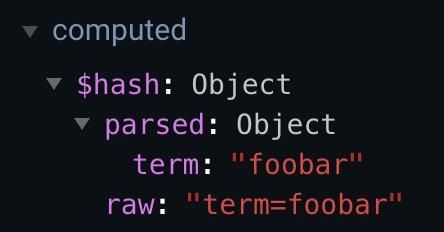
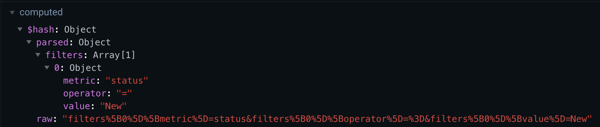

# Vue Hasher

      [](https://codeclimate.com/github/crishellco/vue-hasher/maintainability)

A Vue plugin to sync state with parsed URL hash value.

_This plugin requires that your project use Vue Router_

Check out the [demo](https://vue-hasher.netlify.com/)

## Why?

- Allow users to bookmark:
  - filtered lists
  - searched lists
  - modal states
  - etc.

## Install

```bash
yarn add -D vue-hasher
# or
npm i -D vue-hasher
```

```javascript
import Vue from 'vue';
import VueRouter from 'vue-router';
import VueHasher from 'vue-hasher';

Vue.use(VueRouter);
Vue.use(VueHasher);
```

## Examples

#### Basic sync

```html
<template>
  <input v-model="term" type="text" placeholder="Search term" />
</template>

<script>
  export default {
    name: 'Users',

    data() {
      return {
        term: ''
      };
    },

    beforeMount() {
      /**
       * the first argument is the local state key
       * the second argument is the hash key
       */
      this.$hasher.sync('term', 'term');
    }
  };
</script>
```

#### Vuex

```javascript
import { mapState } = 'vuex';

export default {
  name: 'Users',

  computed: {
    ...mapState('users', ['showModal'])
  },

  beforeMount() {
    this.$hasher.sync('showModal', 'showAddUserModal', (newVal) => {
      this.$store.commit('users/setShowModal', newVal);
    });
  }
};
```

## Hash Encoding and Decoding

- When a hash is set via a VueHasher mixin method, it is first encoded using the [qs](https://www.npmjs.com/package/qs) library's `stringify` method.
- When a hash is privided by the global `$hash` computed property, it is decoded using the [qs](https://www.npmjs.com/package/qs) library's `parse` method.
  - String values `true` and `false` are coicerced to booleans.







## Global Mixin

A global mixin is installed by this plugin.

### Computed

#### `vm.\$hash`

Provides hash information

- Returns `{object}`

```
{
  parsed: { term: 'foobar' },
  raw: '#term=foobar'
}
```

### Methods

#### `vm.\$hasher.clear()`

Clears hash

- Returns `{void}`

---

#### `vm.\$hasher.exists(key)`

Provides if hash key exists

- Arguments
  - `{string} key`
- Returns `{boolean}`

---

#### `vm.\$hasher.remove(key)`

Removes hash value by key

- Arguments
  - `{object} hash`
- Returns `{void}`

---

#### `vm.\$hasher.replace(hash)`

Replaces hash with new value

- Arguments
  - `{object} hash`
- Returns `{void}`

---

#### `vm.\$hasher.set(key, value)`

Sets hash value by key

- Arguments
  - `{string} key`
  - `{mixed} value`
- Returns `{void}`

---

#### `vm.\$hasher.sync(key, watch, hashParsedWatchCallback)`

Syncs a hash key with specific component state.

When first called, it will sync the current hash to the state. It then sets up two watchers -- one for hash changes and one for state changes.

Watchers are destroyed when the component is destroyed.

- Arguments
  - `{string} key`
  - `{string} value`
  - `{function} hashParsedWatchCallback` optional
    - Called when Vue Router hash change detected
    - Invoked immediatey
    - Arguments
      - `{mixed} newVal`
- Returns `{void}`

## Scripts

```bash
yarn lint
```

```bash
yarn test
```

```bash
yarn build
```

## How to Contribute

### Pull Requests

1. Fork the repository
2. Create a new branch for each feature or improvement
3. Send a pull request from each feature branch to the **develop** branch

## License

[MIT](http://opensource.org/licenses/MIT)
